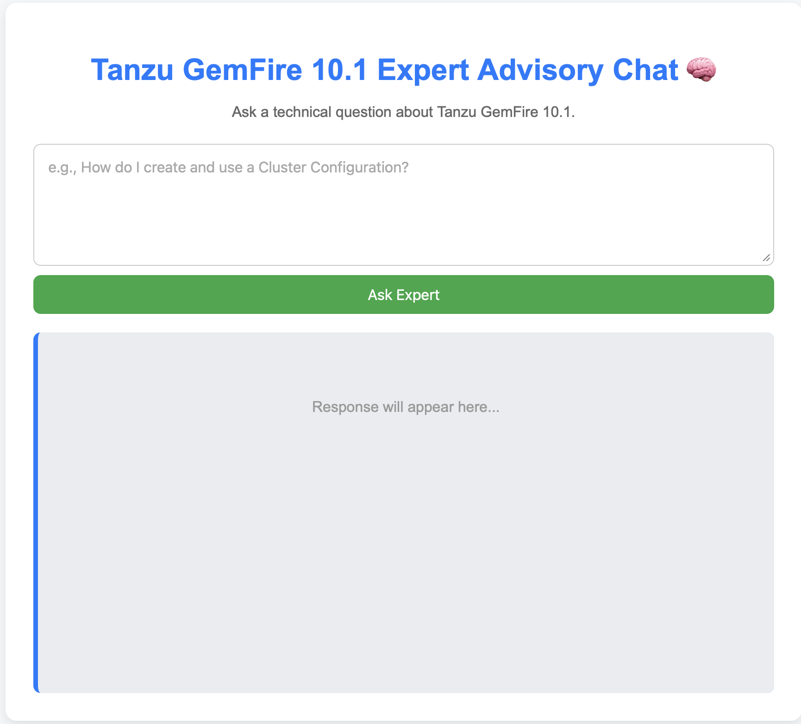

## Here are the key points detailing the workflow for the Specialized Technical Knowledge Retrieval Agent:

## ⚙️ Document Preparation & Storage

* **Document Loading:** The **Tanzu GemFire 10.1 technical manual** is read and converted into raw text.
* **Embedding Generation:** The converted text is chunked into multiple documents, each approximately **500 words** in length. **Vector embeddings** for these chunks are generated using the **mxbai-embed-large LLM**.
* **Vector Storage:** The resulting vector embeddings are stored in a **Vector Store**, specifically **Postgres with the PGVector extension**.

***

## 💬 User Request Processing & Response

* **Role Creation (Prompt Engineering):** A **system role/prompt** is created for the **gemma3n chat model** to establish it as a **Tanzu GemFire 10.1 expert** that must operate within a strict **contextual boundary**.
* **Semantic Search:** A **semantic search** is performed on the **Postgres PGVector** database to retrieve documents. The retrieval criterion is that the documents must be **no more than 65 degrees apart** (presumably a similarity threshold) from the user's query vector.
* **Response Generation:** The final prompt sent to the **gemma3n chat model** is composed of three components:
    * The **Specialized Technical Knowledge Retrieval Agent** system prompt.
    * The relevant **semantic search results (context)**.
    * The **user's original query**.
* **Output Format:** The chat model's final response is to be delivered to the user.

